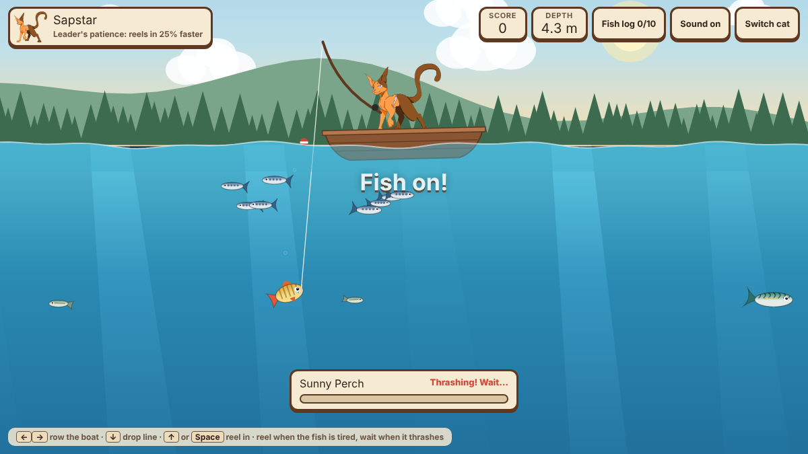

# Whisker Lake 🎣🐱

A small fishing game you play in the browser. Pick one of five clan cats, row your boat across the lake and try to find all 20 kinds of sea life, without hooking too much trash, and without getting eaten by a shark.

**▶ Play it here: https://cmku-dft.github.io/fishing-cat-game/**

## How to play

| Action | Keyboard | Phone / tablet |
| --- | --- | --- |
| Row the boat | ← → or A D | ◀ ▶ buttons |
| Drop the line | ↓ or S | **Drop** button |
| Reel in | ↑, W or Space | **Reel** button |

When a fish bites, it switches between two moods:

- **Thrashing** (red): stop reeling and wait. If you reel now, the line gets tight and can snap.
- **Tired** (green): reel in fast!

Pull the fish up to the surface to catch it. The fish log keeps track of every kind you've found.

Clams, oysters, jellyfish and trash don't fight. They get stuck on your hook as soon as it touches them.

## Sharks!

Sharks swim in the lake and eat smaller fish. They will even steal the fish on your line if you're too slow.

Every so often a shark comes for your boat. A red glow shows which side it's coming from:

- **Row away** as fast as you can. If you stay far enough ahead for long enough, it gives up.
- **Or row into the shallows** near either shore. Sharks can't swim in shallow water.

If the shark reaches your boat, the trip is over. You can try again with the same cat or pick another one.

You can also catch sharks. They are worth 300 points but pull very hard.

## Squids

Squids come in different sizes and three colours: pink, purple and aqua. When you have a fish on your hook, a squid nearby will try to steal it. Reel in fast or row away to escape. You can catch squids too, for 260 points.

## Sea turtles

Three kinds of sea turtle swim in the lake. They hunt jellyfish and eat them. You can catch turtles too.

## The cats

Every cat has a fishing talent. Your cat stands up in the boat with the rod in its paws, and its face changes as you fish: focused while it waits, excited when something bites, happy after a catch, sad when the line snaps, and fed up when it pulls up trash.

| Cat | Clan | Talent |
| --- | --- | --- |
| Sapstar | ThunderClan leader | Reels in 25% faster |
| Leafpelt | ShadowClan warrior | Line tension builds 35% slower |
| Haretail | WindClan warrior | Rows the boat 40% faster |
| Eelfur | RiverClan deputy | Fish notice the hook from farther away |
| Squirrelstripe | RiverClan deputy | Golden Koi show up 3× as often |

## Sea life

| Catch | Where | Points |
| --- | --- | --- |
| Minnow | 1–5 m | 5 |
| Sardine | 1–8 m (swims in schools) | 10 |
| Shrimp | 3–14 m | 15 |
| Sunny Perch | 2–10 m | 20 |
| Jellyfish | 2–18 m (it stings!) | 25 |
| Mackerel | 4–13 m | 30 |
| Clam | Lake floor | 35 |
| Hatchling Turtle (small) | 1–10 m | 45 |
| Green Sea Turtle (medium) | 2–17 m | 90 |
| Leatherback Turtle (large) | 4–23 m | 180 |
| Pufferfish | 6–14 m | 40 |
| Salmon | 8–17 m | 60 |
| Oyster | Deep lake floor | 70 (+250 if it has a pearl) |
| River Eel | 13–21 m | 80 |
| Lobster | Deep lake floor (crawls and fights) | 120 |
| Swordfish | 15–24 m | 150 |
| Anglerfish | 22–28 m | 200 |
| Squid | 4–23 m | 260 |
| Shark | 3–26 m | 300 |
| Golden Koi | Anywhere (rare!) | 500 |

## Trash

Trash costs you points, so try to steer your hook around it.

| Trash | Points |
| --- | --- |
| Tin Can | −10 |
| Plastic Bottle | −15 |
| Plastic Bag | −15 |
| Old Boot | −20 |
| Old Tire | −30 (heavy, slow to reel in) |

The lake is about 29 m deep in the middle and gets shallow near the shores. The water gets dark below about 9 m, so look for the light around your hook.

## Saving your progress

The game saves by itself on your device: your fish log, best score, the current trip's score and your cat. Close the page and come back any time.

Press **Save** (on the lake or on the start screen) to:

- **Copy your save code.** It looks like `WL1-2.BO.DW.3.ZD.1.Z3.2-ZQE`. Keep it as a backup, or paste it into **Load a save code** on another phone or computer to carry on there.
- **Restart trip.** Sets the trip's score back to 0 but keeps your fish log and best score.
- **Reset everything.** Erases all progress on this device. You tap it twice so you can't do it by accident.

## Music

The game plays background music, *Whiskers and Ripples*. Turn it off any time with the **Music** button.

## How it's made

The whole game is one `index.html` file using HTML5 Canvas and plain JavaScript, plus `music.mp3` for the background music. All the pictures are built into `index.html`. It needs no game engine and no install, and it runs on GitHub Pages.

## Credits

- Cat characters and artwork: original drawings by the creator of this repo.
- Fishing poses: a sprite sheet of the same five cats, each with five faces.
- Game code: built with help from Claude, with the boat redrawn with help from ChatGPT.
